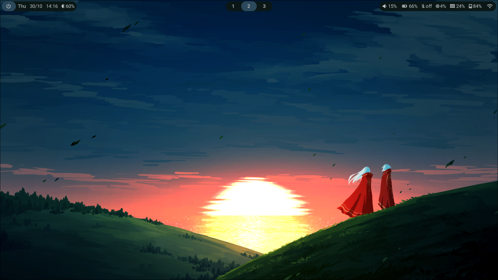
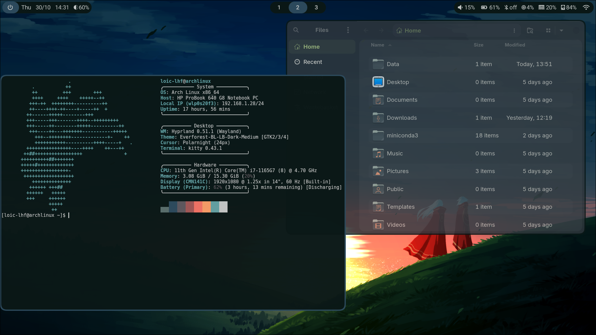
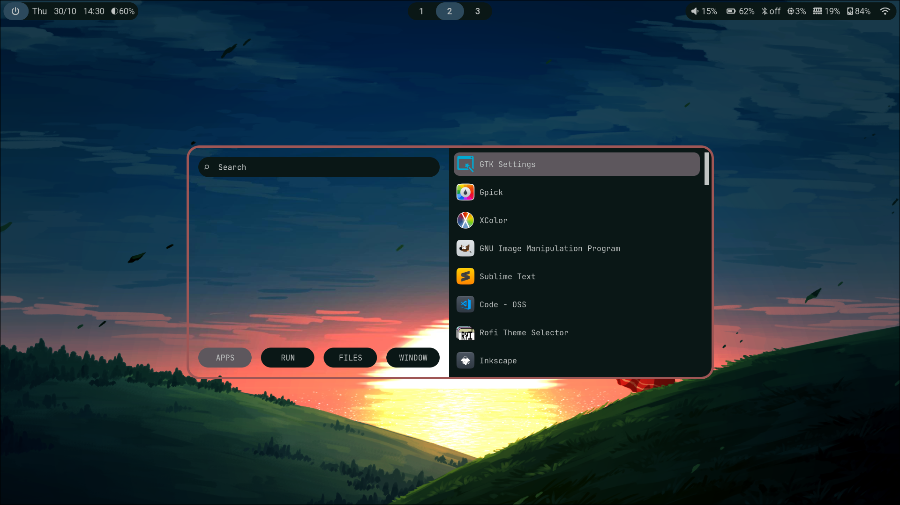
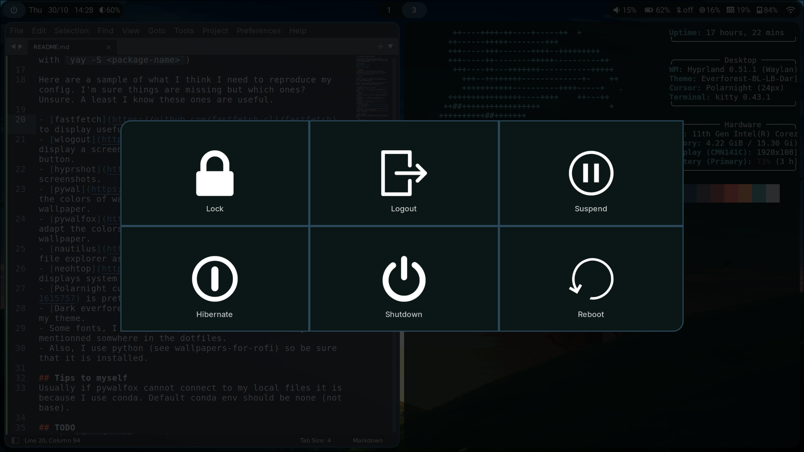

# **`Loic-lhf` Hyprland Dotfiles**

My config files for hyprland, waybar and other functionalities. **First time arch user and its only been a week, some changes will be needed.** But at least I got my config saved somewhere

## Screenshots

> [!WARNING]
> These files are not organized and not actively maintained. You can safely assume that I don't know what I'm doing. But if you like what you see or are just looking for ideas, enjoy my mess.

## Packages

Config running on hyprland 0.51.1 (with hypridle, hyprlock, hyprpaper, hyprsunset: they can be installed with `yay -S <package-name>`)

Here are a sample of what I think I need to reproduce my config. I'm sure things are missing but which ones? Unsure. A least I know these ones are useful.

- [fastfetch](https://github.com/fastfetch-cli/fastfetch) to display useful info on terminal.
- [wlogout](https://github.com/ArtsyMacaw/wlogout) to display a screen with options when pressing the power button.
- [hyprshot](https://github.com/Gustash/hyprshot) to take screenshots.
- [pywal](https://github.com/dylanaraps/pywal) to adapt the colors of waybar, terminal and almost everything to my wallpaper.
- [pywalfox](https://github.com/Frewacom/pywalfox) to adapt the colors of firefox and thunderbird to my wallpaper.
- [nautilus](https://github.com/GNOME/nautilus) for my file explorer as I like it best. 
- [neohtop](https://github.com/Abdenasser/neohtop) displays system usage.
- [Polarnight cursor](https://www.gnome-look.org/s/Gnome/p/1615757) is pretty neet.
- [Dark everforest](https://www.pling.com/p/1695467) for my theme.
- Some fonts, I dont't remember which ones but they are mentionned somwhere in the dotfiles.
- Also, I use python (see wallpapers-for-rofi) so be sure that it is installed.

## Tips to myself
Usually if pywalfox cannot connect to my local files it is because I use conda. Default conda env should be none (not base).

## TODO
- make `fastfetch` prettier.
- add `starship` to stylize kitty even more.
- add a sidepanel with custom functionalities.

